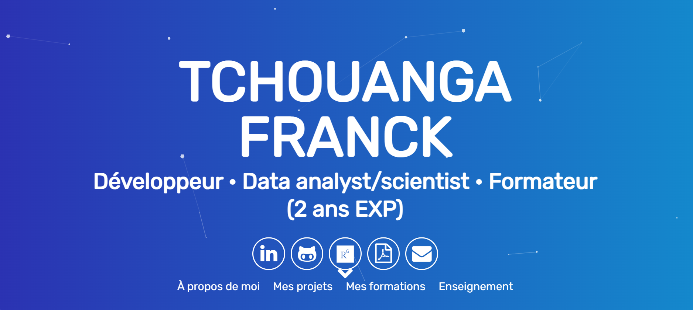

# Tchouanga12.github.io

Welcome to the repository for my personal GitHub Pages website! This project hosts the source code for my personal website, built with HTML, CSS, and JavaScript.

## 🌐 Live Demo

You can visit the live version of the website here: [tchouanga12.github.io](https://tchouanga12.github.io/)

## 📂 Project Structure

Here is a brief overview of the structure of the project:

- **css/**: This directory contains all the CSS files used for styling the website, including custom styles and third-party libraries.
- **images/**: This folder contains all the image assets used on the site.
- **js/**: This folder contains all the JavaScript files, including libraries and custom scripts.
- **index.html**: The main entry point of the website.

## 🚀 Features

- **Responsive Design**: The website is fully responsive and adjusts to different screen sizes, thanks to Bootstrap.
- **Portfolio Section**: A section dedicated to showcasing projects and work samples.
- **Contact Form**: A simple contact form that allows visitors to send messages.

## 🔧 Technologies Used

- **HTML5**: For structuring the content.
- **CSS3**: For styling the content.
- **JavaScript**: For adding interactivity.
- **Bootstrap**: A CSS framework for responsive design.
- **FontAwesome**: For icons.

## 📄 License

This project is **free to use** and does not contains any license.

## 📞 Contact

Feel free to reach out if you have any questions or suggestions! You can contact me via:

- **Email**: [ftchouanga@gmail.com](mailto:ftchouanga@gmail.com)
- **LinkedIn**: [[Tchouanga franck-ai](https://www.linkedin.com/in/tchouanga-franck-ai/)]

---

Thank you for visiting my repository! I hope you find my website useful and informative.

